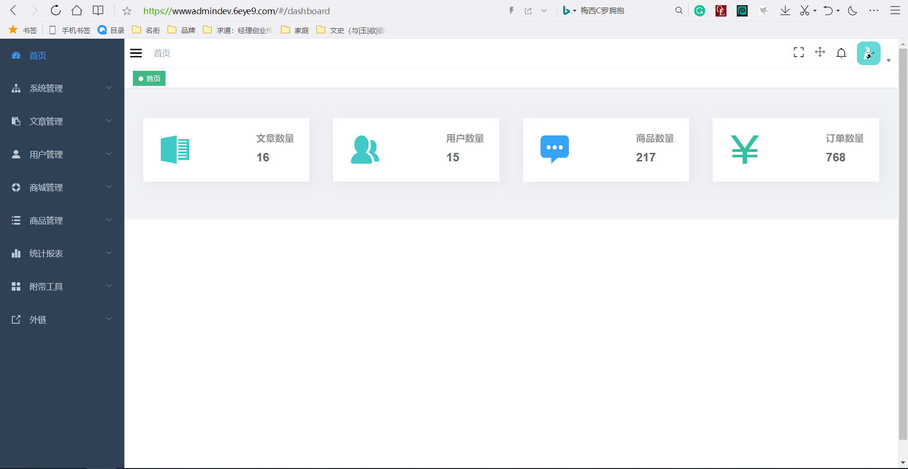

### 管理后台实例



1. 浏览器打开，输入以下网址: [https://wwwadmindev.6eye9.com/](https://wwwadmindev.6eye9.com/)
2. 用户访问用户名`guest`，管理员密码`Guest123`
> 注意：此实例是付费知识平台的管理后台，请勿删除和更改数据。

### 管理平台功能

* 系统管理
* 文章管理
* 用户管理
* 商城管理
* 商品管理
* 统计报表
* 附带工具
* 外链

# vue-element-admin框架项目简介 
**一、vue-element-admin是什么**  
vue-element-admin 是一个后台前端解决方案，它基于 vue 和 element-ui实现。它使用了最新的前端技术栈，内置了 i18 国际化解决方案，动态路由，权限验证，提炼了典型的业务模型，提供了丰富的功能组件，它可以帮助你快速搭建企业级中后台产品原型。

**二、开发工具**  

HBuilderX、HBuilder、vscode、WebStorm等
(开发版本HBuilderX.2.7.5) 
  

# url调整
.env.production 中 VUE_APP_BASE_API 调整 及 .env.development 中 VUE_APP_BASE_API 调整  

# 前序准备
需要在本地安装 node 和 git。本项目技术栈基于 ES2015+、vue、vuex、vue-router 、vue-cli 、axios 和 element-ui  

*注： vue-element-admin使用vue2.x,本项目vue-cli已升级为3.x版本。*

# 问题汇总
运行项目

**使用npm运行项目** 
```
npm install -g mirror-config-china --registry=http://registry.npm.taobao.org  
npm install  
npm uninstall webpack  
npm install webpack@^4.0.0 --save-dev  
npm install webpack -g  
npm install webpack --save-dev  
```

**使用yarn运行项目**
```
yarn install  
yarn dev  

```
编译项目
**使用yarn编译项目**
```
yarn build

```


